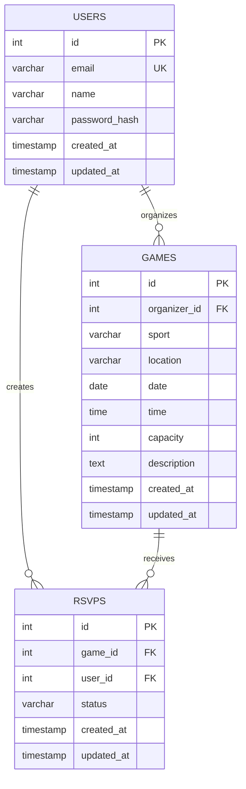

# Entity Relationship Diagram

Reference the Creating an Entity Relationship Diagram final project guide in the course portal for more information about how to complete this deliverable.

## Create the List of Tables

- users
- games
- rsvps: a junction table for many-to-many relationship between users and games

See the schema below:

```sql
-- Users Table
CREATE TABLE users (
    id SERIAL PRIMARY KEY,
    email VARCHAR(255) UNIQUE NOT NULL,
    name VARCHAR(255) NOT NULL,
    password_hash VARCHAR(255) NOT NULL,
    created_at TIMESTAMP DEFAULT CURRENT_TIMESTAMP,
    updated_at TIMESTAMP DEFAULT CURRENT_TIMESTAMP
);

-- Games Table
CREATE TABLE games (
    id SERIAL PRIMARY KEY,
    organizer_id INTEGER NOT NULL,
    sport VARCHAR(100) NOT NULL,
    location VARCHAR(255) NOT NULL,
    date DATE NOT NULL,
    time TIME NOT NULL,
    capacity INTEGER NOT NULL CHECK (capacity >= 2),
    description VARCHAR(1000),
    created_at TIMESTAMP DEFAULT CURRENT_TIMESTAMP,
    updated_at TIMESTAMP DEFAULT CURRENT_TIMESTAMP,
    FOREIGN KEY (organizer_id) REFERENCES users(id) ON DELETE CASCADE,
    CONSTRAINT future_date CHECK (date >= CURRENT_DATE)
);

-- RSVPs Table (Junction Table)
CREATE TABLE rsvps (
    id SERIAL PRIMARY KEY,
    game_id INTEGER NOT NULL,
    user_id INTEGER NOT NULL,
    created_at TIMESTAMP DEFAULT CURRENT_TIMESTAMP,
    updated_at TIMESTAMP DEFAULT CURRENT_TIMESTAMP,
    FOREIGN KEY (game_id) REFERENCES games(id) ON DELETE CASCADE,
    FOREIGN KEY (user_id) REFERENCES users(id) ON DELETE CASCADE,
    UNIQUE(game_id, user_id)
);

-- Indexes for performance
CREATE INDEX idx_games_date ON games(date);
CREATE INDEX idx_games_sport ON games(sport);
CREATE INDEX idx_games_location ON games(location);
CREATE INDEX idx_games_organizer ON games(organizer_id);
CREATE INDEX idx_rsvps_game ON rsvps(game_id);
CREATE INDEX idx_rsvps_user ON rsvps(user_id);

-- Trigger to update 'updated_at' timestamp
CREATE OR REPLACE FUNCTION update_updated_at_column()
RETURNS TRIGGER AS $$
BEGIN
    NEW.updated_at = CURRENT_TIMESTAMP;
    RETURN NEW;
END;
$$ language 'plpgsql';

CREATE TRIGGER update_users_updated_at BEFORE UPDATE ON users
    FOR EACH ROW EXECUTE FUNCTION update_updated_at_column();

CREATE TRIGGER update_games_updated_at BEFORE UPDATE ON games
    FOR EACH ROW EXECUTE FUNCTION update_updated_at_column();

CREATE TRIGGER update_rsvps_updated_at BEFORE UPDATE ON rsvps
    FOR EACH ROW EXECUTE FUNCTION update_updated_at_column();
```

## Add the Entity Relationship Diagram


